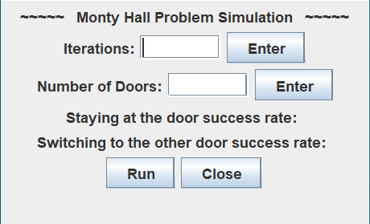

# MontyHall
A Java application created to model the Monty Hall Problem. Uses algorithm to determine the sucessrate of switching doors or staying.
Link to download the [installer](https://drive.google.com/file/d/1eWWnVYAYr4IMnAgHxWmBtcQmqCaZ0VPQ/view?usp=sharing) (Windows only).

# Application Window

